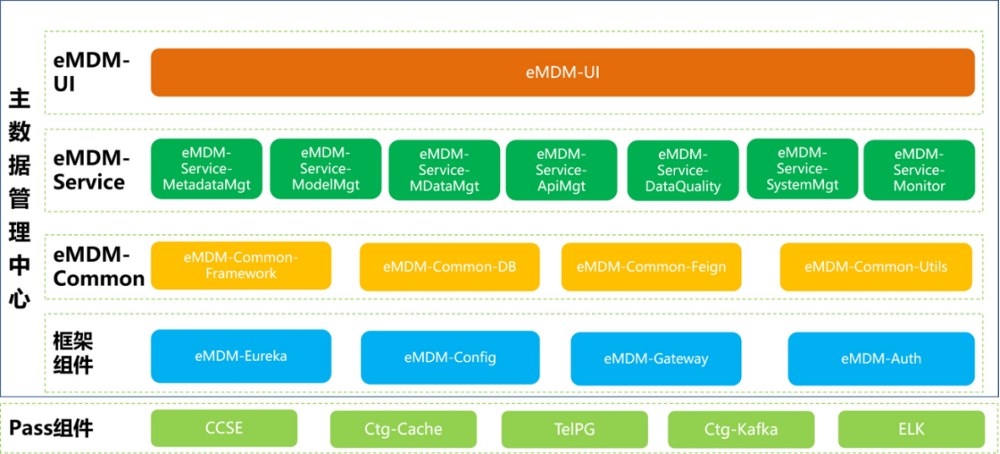
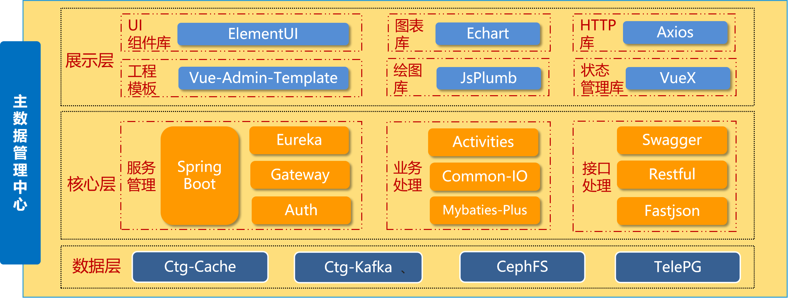
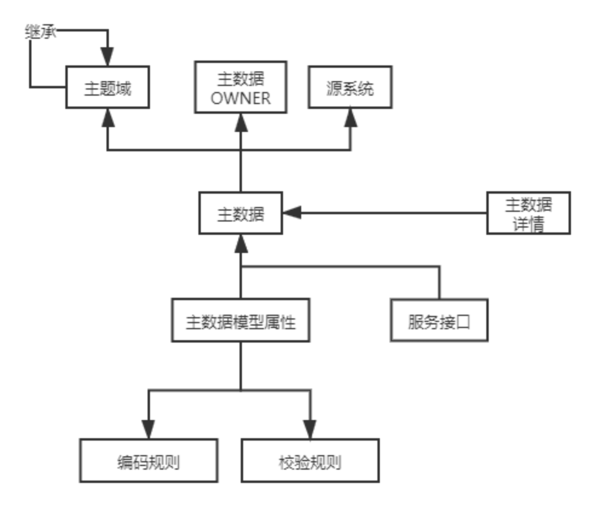

1、思考一下自己负责的系统，或者做过的系统，能否描述清楚其架构

主数据管理平台

一、系统架构
主数据管理平台采用微服务架构，分层模块化设计。主数据管理平台基于Spring Boot 2.3.9，采用SpringCloud Hoxton.SR10 +Vue.js的前后端分离技术架构；采用了Mybaties-Plus、Druid、Jasypt、Activities、Swagger、ElementUI、Vue-Admin-Template、Axios、VueX、Raphael.js等开源技术组件和Ctg-Cache、Ctg-Kafka、TelePG等公司内部统一PASS组件，

技术架构如下：

二、数据模型
