# 毕业总结

## JVM
JVM，Java虚拟机，Java程序的运行依靠具体的Java虚拟机实例，通过JVM实现java语言跨平台运行；JVM实现内存管理，通过类加载器将对象进行实例化运行。

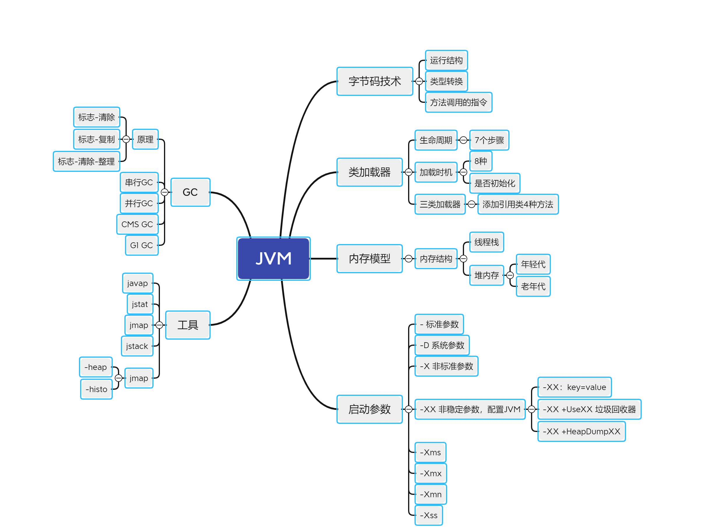

JVM把内存分为线程栈和堆内存，每个线程有自己的线程栈，堆内存则是整个java程序共用；
堆内存分为年轻代和年老代，针对年轻代和年老代采用不同的回收算法进行内存回收。
- JVM内存与相关参数关系
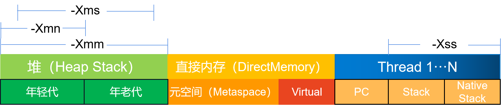
  
JVM调优

通过启动时根据程序的实际情况调整启动参数，可以达到调优效果；启动参数分为标准参数、系统参数、JVM运行参数、内存配置参数等；
常用调优启动参数包括-Xms -Xmx -Xmn -Xss和 -XX +UseXX（GC回收器）

GC

GC算法包括串行GC、并行GC、CMSGC、G1GC、ZGC等，不同GC算法回收效率与分配的内存大小有着直接关系。Java 8 默认GC器为并行GC。

常用工具

jmap：内存查看 -heap ； -histo
jstat：GC信息
jstack：线程信息

## NIO
NIO：Network IO
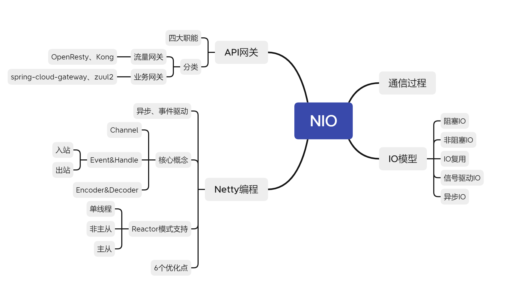
- socket编程
原生Java socket编程：创建socket服务器，绑定端口进行监听；循环处理，接收到请求后进行处理，单线程或建立线程池进行处理；

- IO模式
五种模式：阻塞、非阻塞、复用、信号驱动、异步；前面四种算同步，最后一种才算真正异步；

-Netty框架
异步、事件驱动；适用于服务端、客户端，支持TCP、UDP、HTTP；用于构建高性能的服务器

核心概念：通道、事件、序列化；

适配器：ChannelInboundHandlerAdapter、ChannelOutboundHandlerAdapter

一般流程: 新建ServerBootstrap、配置相关参数、建立事件处理组，建立通道绑定端口；实现适配器接口，进行出入站事件处理；

6点优化：不要阻塞EventLoop、系统参数优化、缓冲区优化、心跳周期优化、内存与ByteBuffer优化、其他优化

## 并发编程
并发编程：随着计算资源的丰富，通过并发编程能有效的提高程序的性能和处理能力。

并发编程基于多线程实现，但多并发又会引入了线程安全问题，
因此引入了锁的概念来解决，一般分读锁和写锁，并且注意尽可能的降低锁的范围；作为优化方案，可以采用原子类Atomic方案。

可以直接调用线程创建方法动态创建线程，但一般建议使用线程池方式，线程池分为单线程、固定大小、可缓存（可变）线程和无限大小线程池方式，
常用的是可变线程池方式。

线程间的协同等待可通过使用信号量、CountDownLath、CycleBarrier，其中CountDownLath用于在主线程中等待全部子线程完成，
CycleBarrier用于在子线程中等待其余线程全部启动。
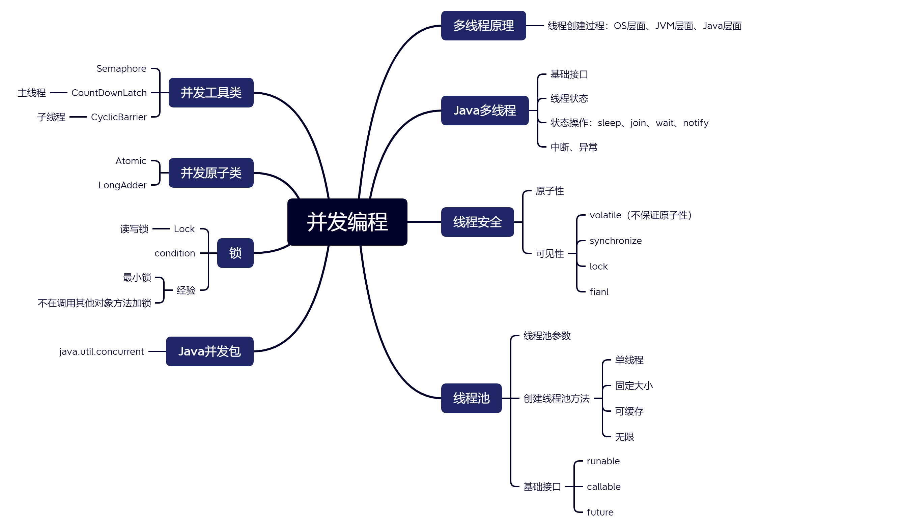
## Spring 和 ORM 等框架
Spring不单为引入一种开发框架同时引入了一种共享方法；Spring框架一共有6大模块，其中Core、Testing、DataAccess、MVC为常用的四个模块；
Spring AOP基于动态代理的方式实现，如果是实现了接口的话就会使用jdk动态代理，反之则会使用CGLIB代理。
aop中的应用主要体现在 事务.日志 .异常处理等的方面。通过在代码的前后做一些增强处理，可以实现对业务逻辑的隔离，提高代码的模块化能力，同时也是解耦。
spring主要提供了Aspect切面，JoinPoint连接点，PointCut切入点，Advice增强等的实现方式。
Spring Boot的两大核心为自动化配置和脚手架，遵守约定大于配置的原则，简化了开发工作；
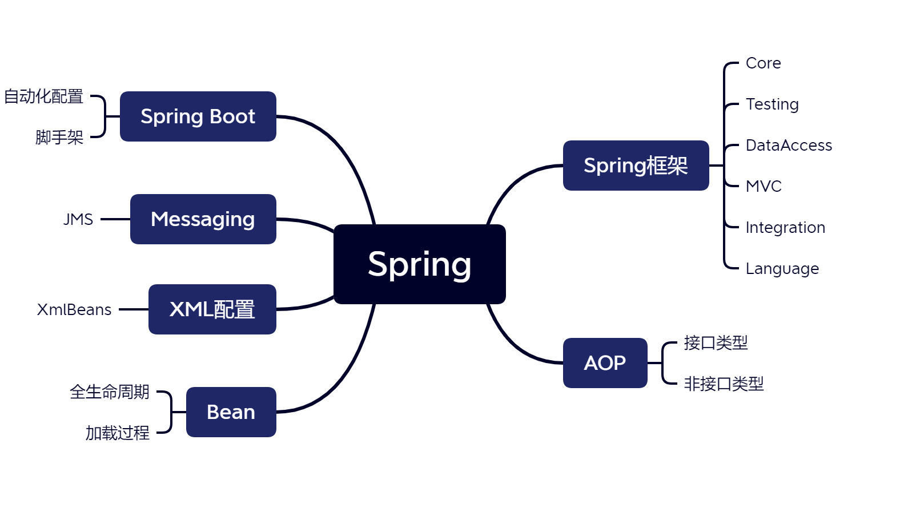

orm：对象关系映射（Object Relational Mapping，简称ORM）模式是一种为了解决面向对象与关系数据库存在的互不匹配的现象的技术。
ORM框架是连接数据库的桥梁，只要提供了持久化类与表的映射关系，ORM框架在运行时就能参照映射文件的信息，把对象持久化到数据库中。
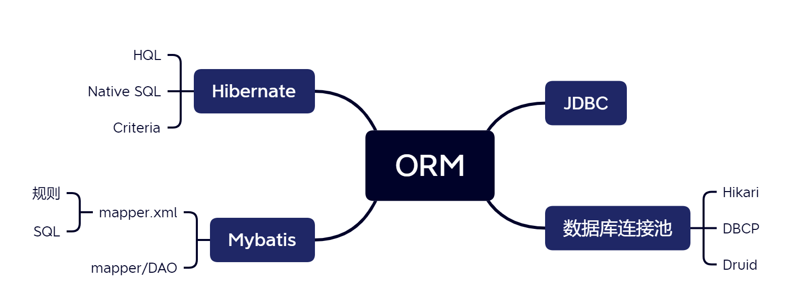

## MySQL 数据库和 SQL
SQL (Structured Query Language:结构化查询语言) 是用于管理关系数据库管理系统（RDBMS）。 
SQL 的范围包括数据插入、查询、更新和删除，数据库模式创建和修改，以及数据访问控制。
根据数据库设计的约束分为第一范式、第二范式、第三范式、第四范式、第五范式；

MySQL，一个关系型数据库管理系统，用来持久化保存数据。
一个表的数据一般不要超过2000万，否则将严重影响性能。
配置优化包括连接请求变量、缓冲区变量和Innodb配置变量。

MySQL事务：
1、read uncommitted（读未提交）事务中最低级别，可以读取未提交的数据，也称脏读。危险少用。
2、read commited（读提交）大多数数据库默认隔离级别，只能读取已经提交的内容。但无法避免重复读和幻读。
3、repeatable read（可重复读）Mysql默认事务隔离级别。可避免不可重复度和脏读的问题，确保同一个事务的多个实例在并发读取数据时，会看到同样的数据。
4、serializable（可串行化）事务的最高隔离级别。他它对强行对事务进行排序，使之不会发生冲突，实际上是在每个读的数据行前加个锁，这种级别可能导致大量的超时现象和锁竞争。
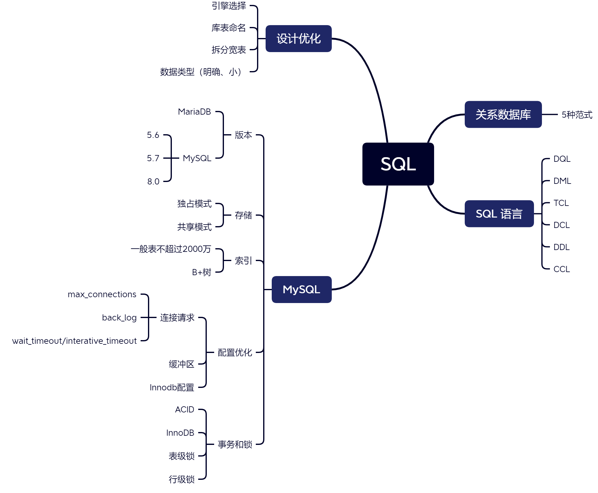
## 分库分表
分库分表的目的就是为了缓解数据库的压力，最大限度提高数据操作的效率。
数据库拆分分为垂直拆分、水平拆分；垂直拆分根据业务特性进行，对原有业务系统改造要求较大；

垂直拆分中选择拆库、拆表原则：如果磁盘IO成为瓶颈采用拆库，如果为单表数据量过大采用拆表；

水平拆分可以按照主键、按照时间、按照条件和自定义方式，目前常用的为按照主键和按照时间；

常用的框架为ShardingSphere，常用中间件为MyCat、ShardingSphere-Proxy

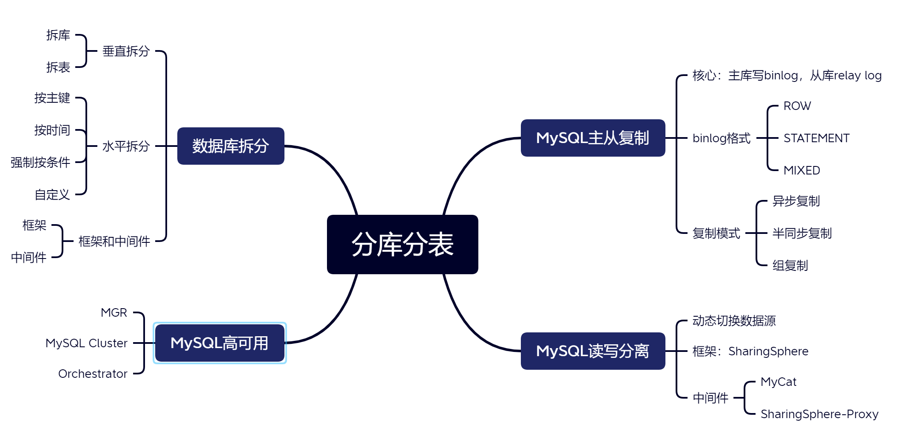
## RPC 和微服务
微服务是一种分布式的方式，通过微服务可以将业务拆分，使业务职责单一化，业务解耦。
微服务通常都是集群部署，服务之间的通信需要通过RPC完成。
集群需要通过服务治理去管理，服务治理主要管理：接口方法和服务之间的映射关系、负载均衡、健康检测、服务续约、服务发现、容灾容错等。
服务治理主要有：服务发现、服务续约、健康检测、负载均衡、容灾容错等。主要是通过将服务注册到注册中心实现这些功能。比较出名的注册中心有：Eureka、nacos、zookeeper等。

RPC是基于分布式架构而出现的，现在RPC主要是通过TCP传输协议和高效的序列化反序列完成。
RPC实现过程包括设计、代理、序列化、网络传输和查找实现类。
高性能的TCP传输手动主要是通过IO的多路复用和零拷贝，最典型的框架就是netty，而IO的多路复用主要手段有select、poll、epoll，其中epoll是liunx主要的io多路复用模型的手段，也是性能最高的。
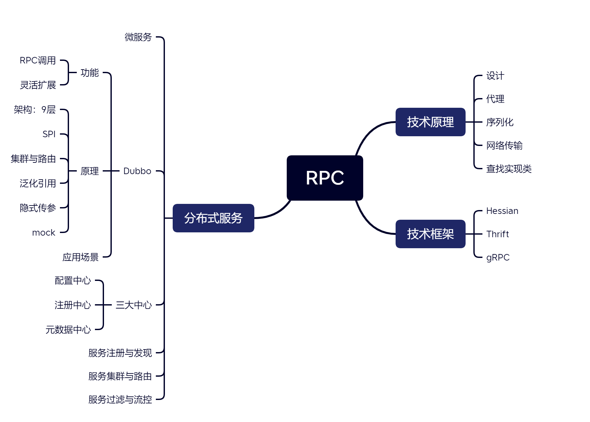
## 分布式缓存
分布式缓存的目的在于实现高性能、动态扩展性、高可用性、易用性和分布式代码执行。
采用缓存时需考虑容量和过期策略两大因素，同时需防止出现缓存穿透、击穿、雪崩等偶发问题。

常用的缓存中间件为Redis。
Redis提供了5中基本数据结构和3种高级数据结构。可以应用在6种场景中，其中业务数据缓存场景最为常见。
通过Redis实现分布式锁：获取锁->释放锁：采用lua脚本。
常用的Java客户端为jedis。
Redis提供了与Spring整合工具：Spring Data Redis
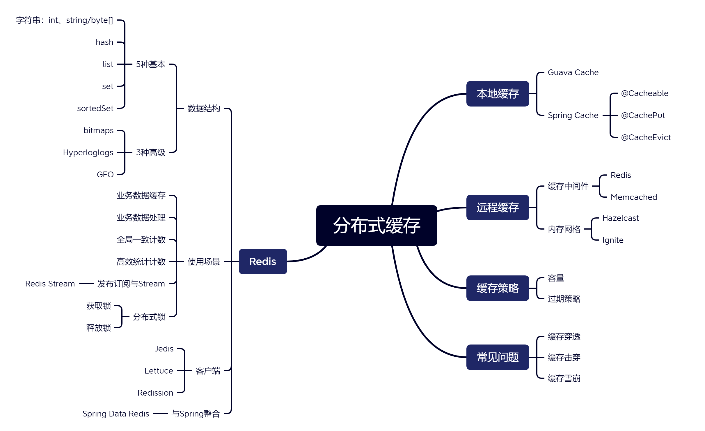
## 分布式消息队列
采用消息队列的目的为系统之间异步通信、系统之间解耦、流量削峰、消息广播功能。
分布式消息队列，比如常见的有kafka,ribbitmq,rocketmq,activemq等等。
Kafka核心概念为Topic、producer、consumer。同一个消费组的consumer对同一个消息仅会消费一次。
生产者确认模式根据写入程度不同分三种：接收到直接返回、写入Leader、全部写入，其中模式一不返还offset值；
生产者特性：同步发送、异步发送、顺序保证、消息可靠性传递。
消费者特性：offset同步提交、异步提交、自动提交、seek。
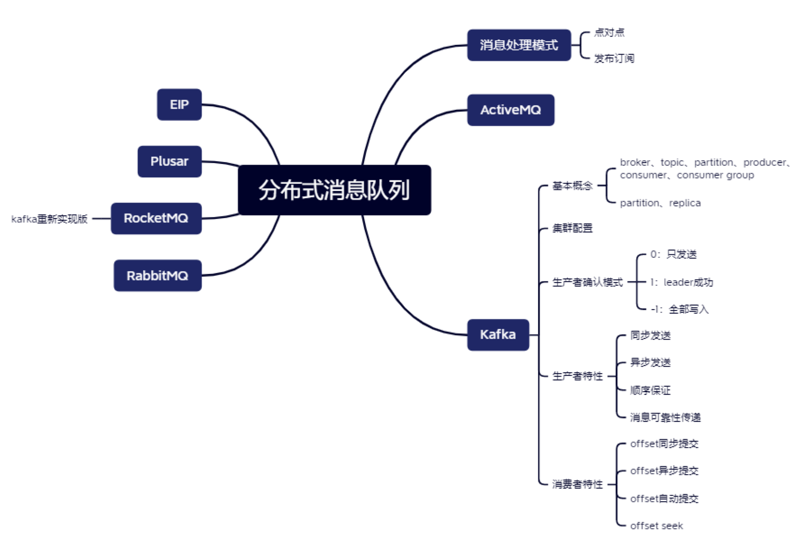